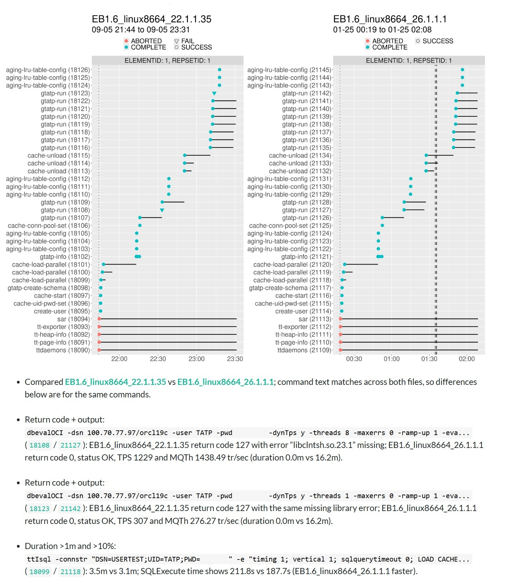
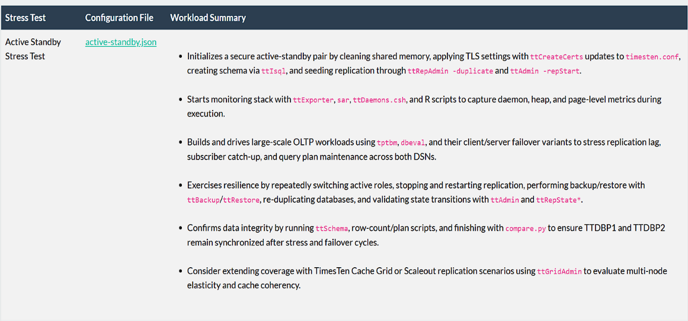

# AI

## Data Analysis

The screenshot below is from an application that compares the results of a long running stress test executed against two different versions of a database. The graphs show the progression of processes over the duration of the test.

The text below the graphs is automatically generated by an AI agent (Codex). The agent is instructed to compare the output for each corresponding process and describe any significant differences. In this case the agent has correctly identified that two processes failed due to missing shared libraries. This combination of structured data visualization and AI analysis of text is very effective in detecting problems.



## Functional Testing

The SQL queries below demonstrate a bug where the first query returns an incorrect result. The only difference between the queries is that the second one uses an optimizer hint. But optimizer settings should not alter query results. This bug was detected by an AI generated program that is capable of validating query results.

```         

SQL> SELECT jt.dv_leg_number, jt.dv_leg_type,
  2         l.leg_number     AS rel_leg_number,
  3         l.leg_type       AS rel_leg_type
  4  FROM  (SELECT data FROM trade_dv
  5         WHERE  json_value(data, '$._id' RETURNING NUMBER) = 1) dv
  6  CROSS JOIN JSON_TABLE(dv.data, '$.legs[*]' COLUMNS (
  7      dv_leg_number NUMBER       PATH '$.legNumber',
  8      dv_leg_type   VARCHAR2(20) PATH '$.legType')) jt
  9  JOIN trade_legs l ON l.trade_id = 1 AND l.leg_number = jt.dv_leg_number;

0 rows selected. 


SQL> SELECT /*+ NO_MERGE(dv) */
  2         jt.dv_leg_number, jt.dv_leg_type,
  3         l.leg_number     AS rel_leg_number,
  4         l.leg_type       AS rel_leg_type
  5  FROM  (SELECT data FROM trade_dv
  6         WHERE  json_value(data, '$._id' RETURNING NUMBER) = 1) dv
  7  CROSS JOIN JSON_TABLE(dv.data, '$.legs[*]' COLUMNS (
  8      dv_leg_number NUMBER       PATH '$.legNumber',
  9      dv_leg_type   VARCHAR2(20) PATH '$.legType')) jt
 10  JOIN trade_legs l ON l.trade_id = 1 AND l.leg_number = jt.dv_leg_number;

DV_LEG_NUMBER DV_LEG_TYPE          REL_LEG_NUMBER REL_LEG_TYPE        
------------- -------------------- -------------- --------------------
            1 LONG                              1 LONG                

1 row selected. 
```

## Document Generation

The document snippet below was created using an AI generated program that combines and summarizes information from several different data sources. In this case the document describes a complex stress test configuration. After the program gathers the information, AI is used generate a concise summary of what the test configuration does. It also suggests how the test configuration can be improved.



------------------------------------------------------------------------
