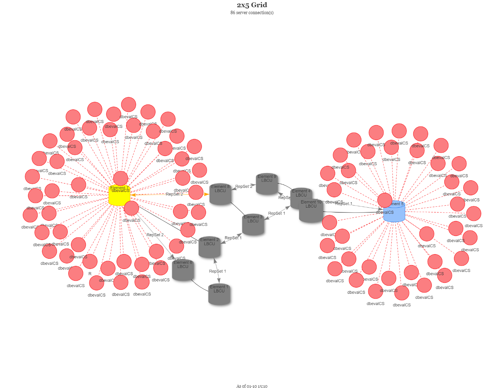
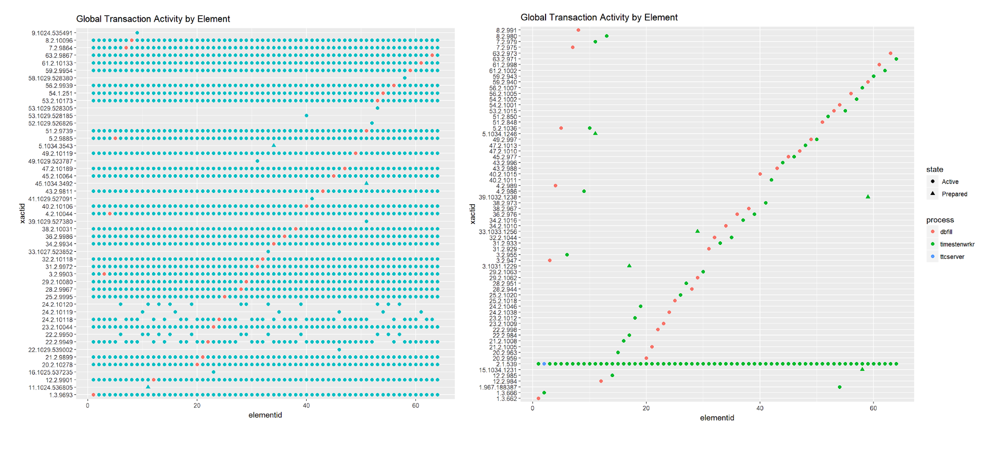
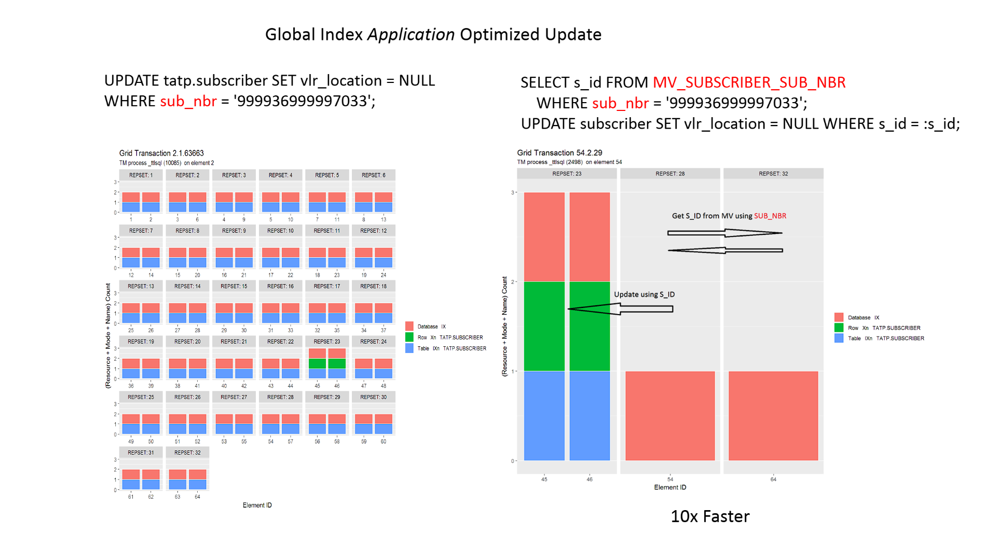

# Distributed Systems

## Database Nodes

The network graph below was generated using data from a distributed database. Each of the blue circles is a workload process connected to one of the database nodes. And each database node has a corresponding replica node to ensure fault tolerance. This is a healthy system where the workload is evenly distributed and every node is available.

In contrast, the graph below depicts a system experiencing severe problems where 8 of 10 nodes have failed (grey). This scenario occurred during a long running stress test. Database nodes were purposefully disabled to verify that client applications (red) automatically failed over to surviving nodes.

Even with 8 of 10 nodes down, every client connection rerouted to the two surviving nodes without dropping — confirming automatic failover held up under one of the most severe failure scenarios the system could face.

## Distributed Transactions

The graphs below indicate which nodes (x axis) are associated with particular transactions (y axis). The left hand graph depicts a serious problem where transactions unnecessarily and inefficiently access all nodes in the system. The right hand graph depicts the same scenario after the problem was fixed. Only the nodes required to fulfill the request are accessed resulting in improved in performance.

The left chart shows dense row access across nearly every node for nearly every transaction, while the right chart's sparse diagonal pattern shows each transaction touching only its home node — the visual signature of the fix.

Isolating this multi-node access pattern and rewriting it to touch only the required nodes delivered a 10x performance improvement.

This animation shows the row level resources acquired by various queries across the nodes of a distributed database. The location of the acquired rows depends on the node where the query is executed and whether any remote nodes have failed (grey columns).

------------------------------------------------------------------------
