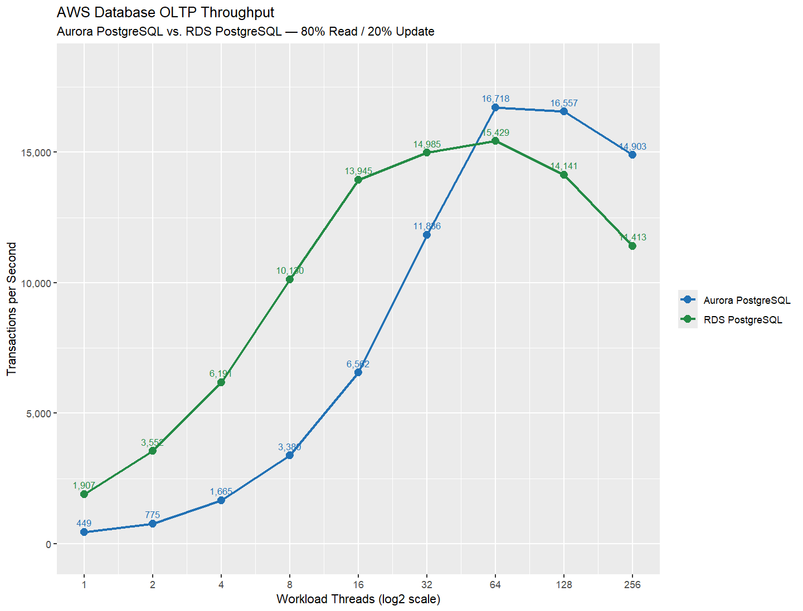
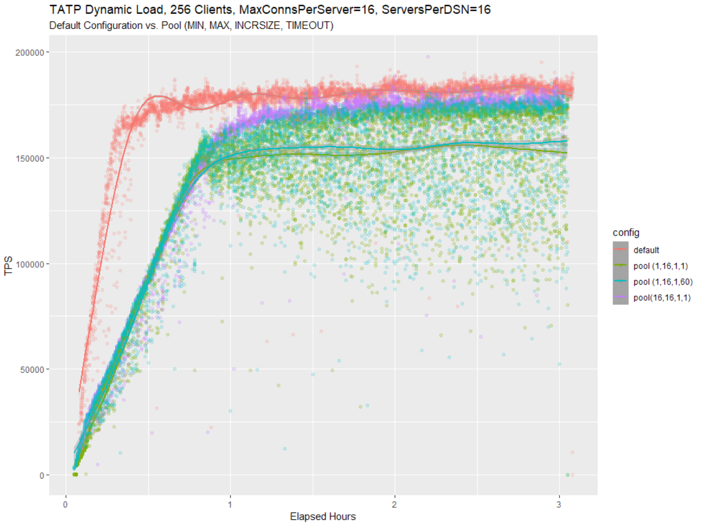
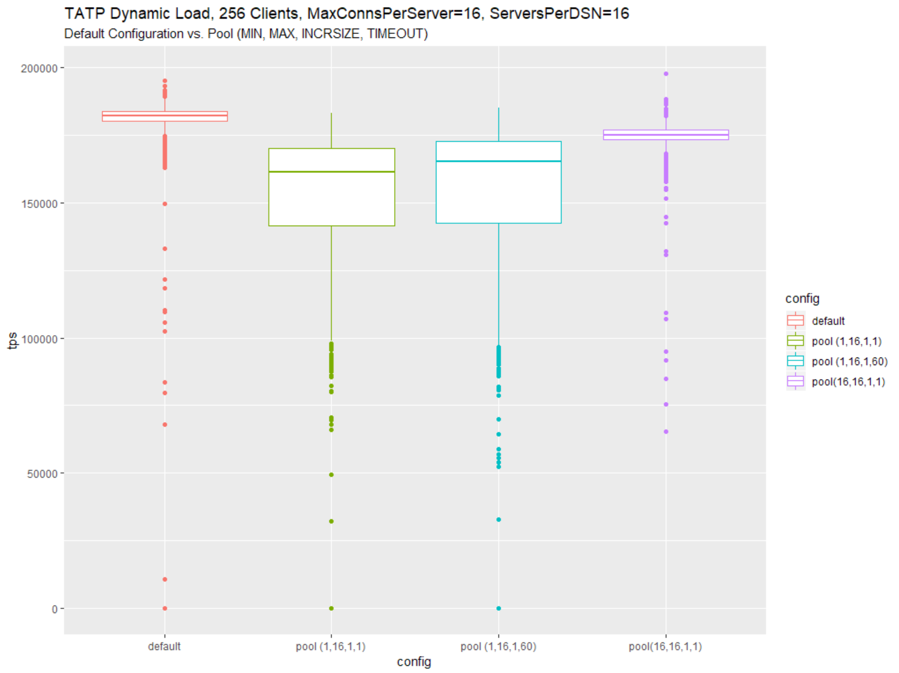
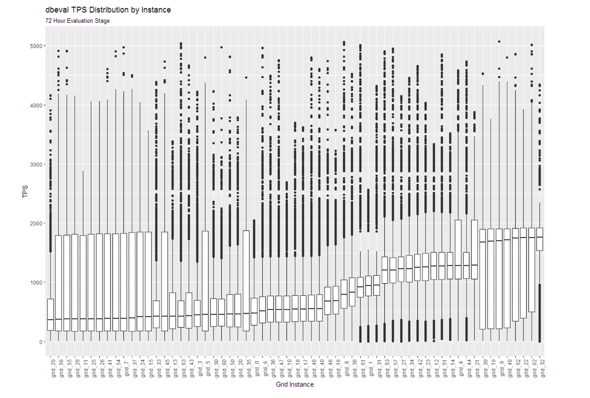

# Performance

Poor performance can ruin the value of otherwise high quality software. The studies below show how performance changes under various configurations and conditions, allowing developers to use their limited time wisely to optimize different operations.

## AWS Databases

For two PostgreSQL compatible AWS databases, the plot below depicts how transaction throughput changes as the number of threads increase for a simple OLTP workload. I designed and built the distributed load and performance [test tool](https://github.com/jfeldhaus/awsbench) used here, which deploys workloads across docker container instances managed by the Elastic Container Service (ECS) in AWS, with SQS and SNS coordinating work across instances. Performance tests like this one reveal how applications scale.

Aurora PostgreSQL trails RDS PostgreSQL at low concurrency but overtakes it beyond 32 threads, peaking near 16,700 TPS at 64 threads compared to RDS's peak of roughly 15,400 TPS — a reminder that the better-performing engine can depend entirely on workload concurrency.

## Connection Pools

This plot was created using data collected during a connection pool test I designed for an application that caches data. As the workload begins and the cache fills, performance improves for all configurations. But the default (red) configuration performs best because it is not constrained by the limits of a connection pool.

This plot uses the same data set as above, but instead of a time series, the data is compared using box plots which clearly show how performance varies for each configuration. These box plots have long lower tails since workload performance improved over time. Tests like this one help developers determine optimal configurations for their applications.

The default configuration sustains roughly 180,000 TPS with a tight distribution, while the pooled configurations settle 15-30% lower with noticeably wider spread — confirming that pooling traded raw throughput for connection control in this workload.

## Transaction Response Times

This plot shows the average transaction response times, measured with a test harness I built, for an application with 16 workload threads. Each transaction type is broken out into several individual call variants, which is why multiple bars appear within each color group. In this case query transactions perform best, as expected, followed by delete and then insert/update transaction types. This type of test helps developers determine where they should spend their time when optimizing transactions.

Query transactions respond in well under 100 microseconds, while put (insert/update) transactions run 3-4x slower than delete transactions — making inserts and updates the clearest target for optimization.

## Distributed Systems

These box plots, generated with an R-based analysis pipeline I built, show how a workload executing on each node of a 64 node distributed system perform over a long duration load test. The nodes are ordered from left to right based on the median TPS measurement for each node. Visualization techniques like this one help developers understand, at a high level, how the entire system performs, even with a large number of nodes.

Median throughput varies more than 4x between the slowest and fastest nodes, highlighting the kind of node-level imbalance that is easy to miss when only looking at aggregate system-wide TPS.

------------------------------------------------------------------------
