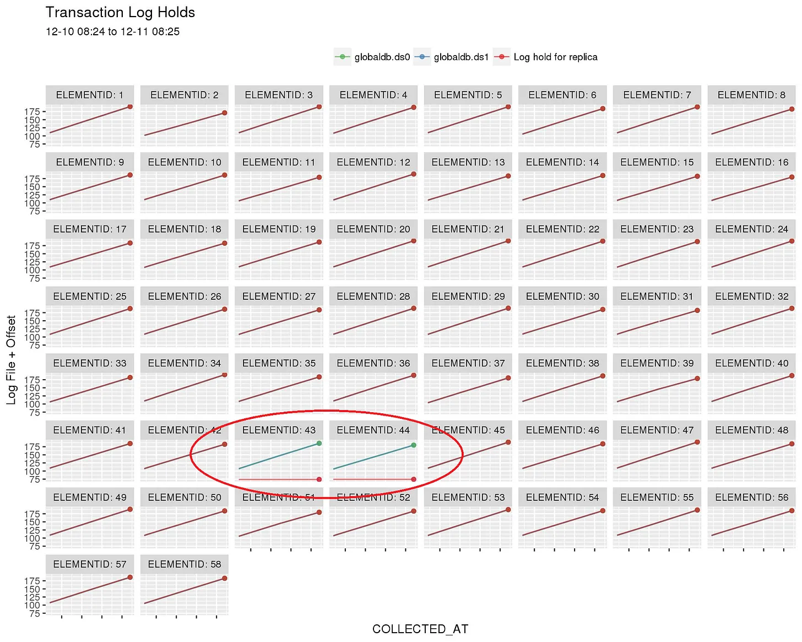
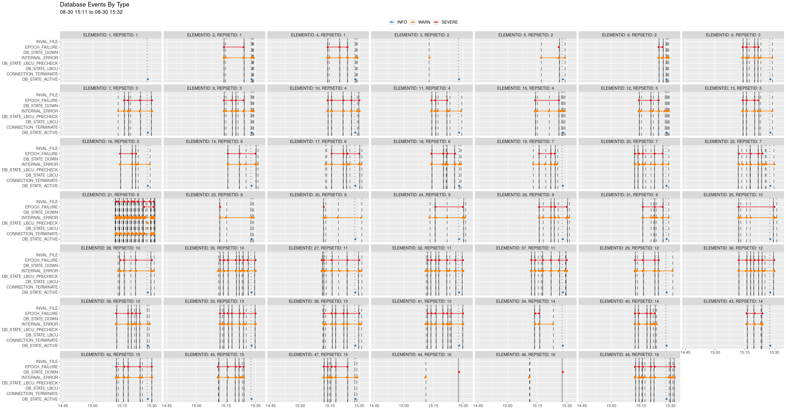
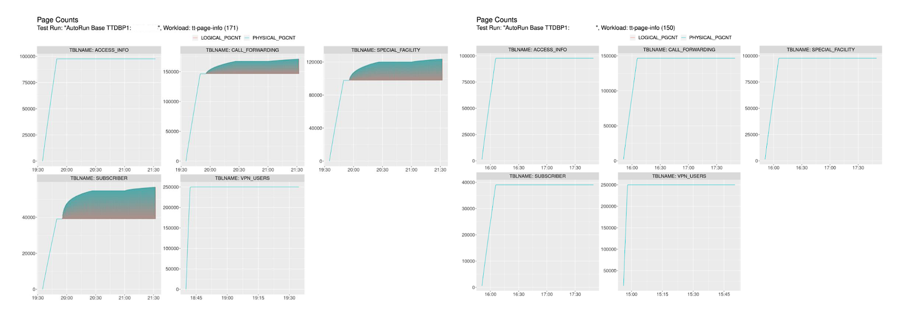
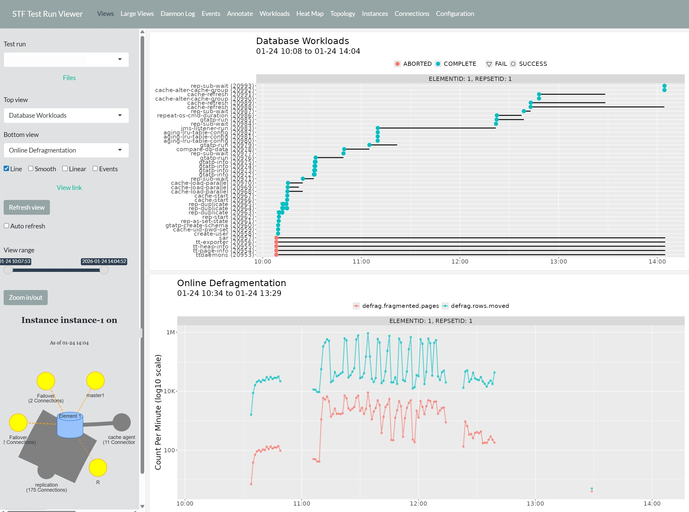

# Stress Testing

The images below are from a database stress testing framework that automates the collection of a wide range of data across multiple nodes while managing the execution of complex distributed workloads. The goal is to detect anything that could impact the correct and efficient functioning of the system under extreme conditions.

## Anomaly Detection

This graph depicts the write progression of database transaction logs during a workload simulation for a database composed of 58 compute nodes. The simulation revealed an initially subtle, but ultimately fatal problem where nodes 43 and 44 failed to purge log files which resulted in disk space exhaustion.

While 56 of the 58 nodes purged their logs on schedule (the log offset resets and continues climbing), nodes 43 and 44 plateaued and never released their hold — the two lines that keep climbing unchecked while the corresponding replica log holds (red) go flat.

## Events

This graph visualizes failure event data collected during a complex stress test of a distributed system. Capturing and visualizing failure patterns can help developers design systems that isolate the effects of failing nodes from the remaining healthy nodes.

Most elements show correlated EPOCH_FAILURE and INTERNAL_ERROR events clustering within the same narrow time window, while a few elements (such as ELEMENTID 1 and ELEMENTID 3) remained largely unaffected — a pattern that helped isolate the failure to a specific subset of the system rather than a global event.

## Resources

Data collection of system performance and resource usage is a basic requirement for effective stress tests. Resource leaks, like the ones below (shaded areas), can be ticking time bombs in production systems.

Three of the five tables (`CALL_FORWARDING`, `SPECIAL_FACILITY`, `SUBSCRIBER`) show a widening gap between logical and physical page counts — a growing leak — while `ACCESS_INFO` and `VPN_USERS` show no gap at all, isolating the leak to specific table access patterns rather than the whole system.

## Observability

The interactive application below is used to monitor the status of complex simulations of telecommunications, trading and e-commerce workloads in near real time. It provides many different views of metrics and unstructured data generated over hours, days or weeks. This allows even the most obscure problems to be identified and traced back to their origins.

In this view, over 40 workload steps are correlated on a single timeline against a defragmentation metric that peaks near 1M rows moved per minute, making it possible to line up a specific workload phase with its resource impact.

------------------------------------------------------------------------
